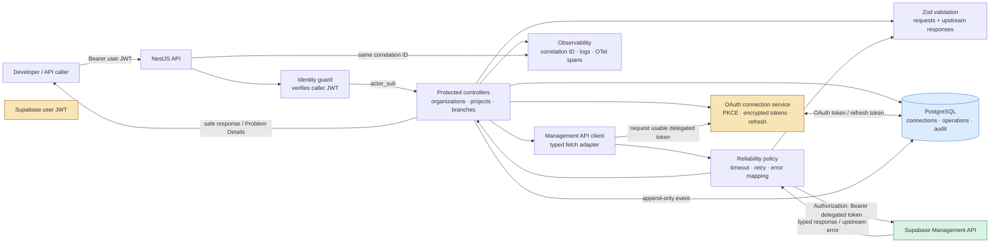

# Management API architecture and flow

This diagram shows how BranchPilot handles Management API requests. The caller's
Supabase user JWT identifies the BranchPilot user; a separately stored OAuth
token authorizes the outbound request to Supabase.



## Branch creation flow

```mermaid
sequenceDiagram
  participant C as Caller
  participant B as BranchPilot controller
  participant O as OAuth service
  participant D as PostgreSQL
  participant M as Management API client
  participant S as Supabase Management API

  C->>B: POST /v1/projects/:ref/branches<br/>JWT + Idempotency-Key
  B->>B: Verify JWT; validate request; create correlation ID
  B->>D: Create/find branch operation<br/>(actor_sub, idempotency_key)

  alt Same key + same request
    D-->>B: Existing operation
    B-->>C: Return original result
  else New operation
    B->>O: Obtain usable delegated token
    O->>D: Read encrypted connection
    alt Token near expiry
      O->>S: Refresh OAuth token
      O->>D: Encrypt and persist new token/version
    end

    B->>M: createBranch(persistent=false, with_data=false)
    M->>S: POST branch request

    alt Successful response
      S-->>M: Branch identity + status
      M-->>B: Zod-validated normalized result
      B->>D: Update operation + audit event
      B-->>C: 201 operation / branch result
    else Upstream 401
      S-->>M: 401
      M->>O: Refresh once
      M->>S: Replay once
    else Timeout / ambiguous POST
      S--xM: Unknown outcome
      M-->>B: Do not blindly retry
      B->>S: List branches and reconcile by name
      B->>D: Record resolved or unknown outcome
      B-->>C: Result or retryable outcome-unknown error
    else Invalid response / 403 / 429
      M-->>B: Normalized typed error
      B->>D: Sanitized audit event
      B-->>C: Problem Details response
    end
  end
```

## Core components

- **Identity guard:** validates the caller's Supabase JWT and extracts the stable `actor_sub` identity.
- **OAuth connection service:** runs the PKCE OAuth flow, encrypts delegated tokens, and refreshes them when necessary.
- **Management API client:** makes only the approved typed requests to the Supabase Management API.
- **Reliability policy:** centralizes timeouts, safe retries, `401` refresh-and-replay, and upstream error normalization.
- **PostgreSQL:** stores OAuth connection state, idempotent branch operations, and append-only audit events.
- **Observability:** carries one correlation ID across the HTTP request, database activity, audit event, logs, and trace spans.
